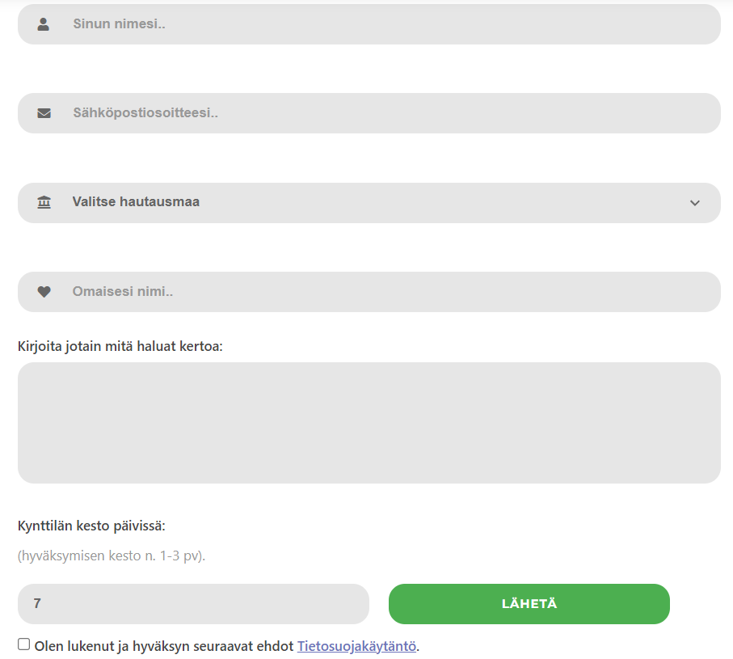
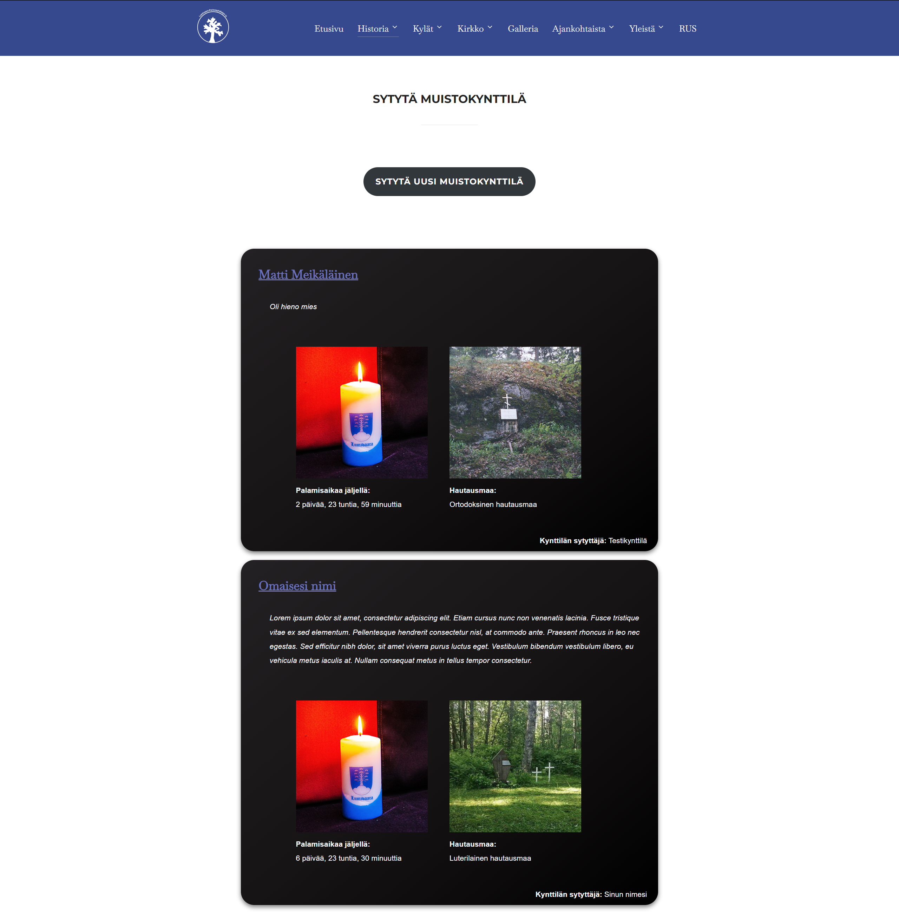
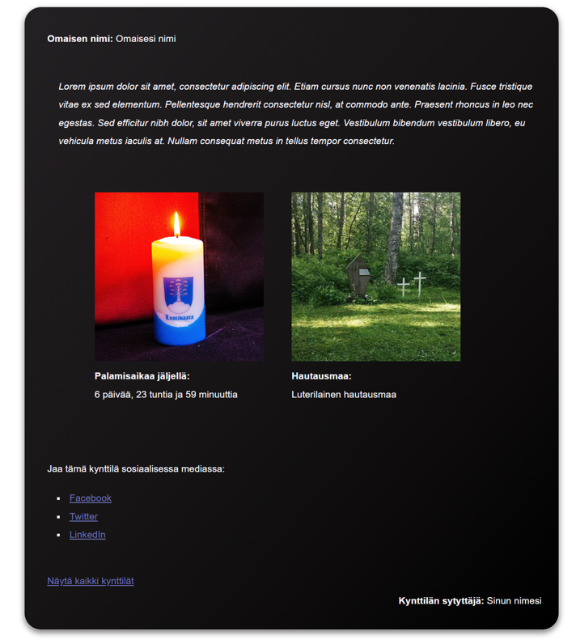

My thesis, feel free to check it out here: https://www.theseus.fi/handle/10024/811679

The subject of this thesis was to develop a ‘Light a Candle’ -WordPress plugin,
which will allow users to create innovative way to light virtual memorial candles
for their deceased loved ones who passed away in Lumivaara. Lumivaara is located
in Karelia, which is a former municipality in Finland that was relinquished to the
Soviet Union in 1944 at the conclusion of the war. This thesis is commissioned by
the members of Lumivaara-Perinneyhdistys ry
The development of ‘Light a Candle’ -WordPress plugin was one of the main parts
of developing the Lumivaara project. The Lumivaara association has previously received a completely new website and layout, as well as numerous other features
which are working under WordPress content management system (CMS).

This thesis focuses on the WordPress content management system in general, installation, versions, themes and security, and of course from a developer's point
of view in developing, installing and deploying your own WordPress plugins.

